# セルフペースドハンズオン

## 準備

本環境を実行するには下記の準備が必要です。

| 必要なもの | 説明 |
|----|----|
| LINEアカウント | LINEアカウントをお持ちでない場合は、スマートフォンで[LINEをダウンロード](https://line.me/) し、LINEアカウントを作成してください。 |
| Azureアカウント | Azureアカウントをお持ちでない場合は、[こちら](https://azure.microsoft.com/ja-jp/free/) から作成してください。新規作成すると無料枠が適用されます。 |
| GitHubアカウント | GitHubアカウントをお持ちでない場合は、[こちら](https://github.com/join) から作成してください。 |

本ハンズオンで作成するアプリは、LINE のスマートフォンアプリ内で開くLIFFブラウザでの動作を想定しています。

また、本アプリは Google Chrome や Microsoft Edge などの外部ブラウザで開いた場合も利用できるよう調整していますが、その場合は、LINEアカウントでのログインが求められます。外部ブラウザの場合は、シェア機能は利用できません。

## 大まかな流れ

1. LINE アカウントで LINEログインのチャネルを作成する
1. GitHub リポジトリをテンプレートから作成する
1. Azure にリソースをデプロイする
2. LIFF にフロントエンドのURLを設定する

## LINE アカウントで LINEログインのチャネルを作成する

まず、[LINE Developersコンソール](https://developers.line.biz/console/)にログインし、プロバイダーと「LINEログイン」のチャネルを作成します。

LINE Developersコンソールを開機、プロバイダーの「作成」ボタンを選択します。

任意のプロバイダー名を入力し、「作成」ボタンを選択し作成します。

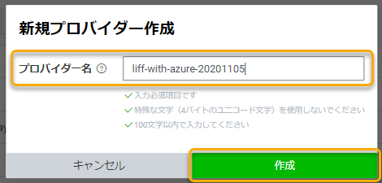

プロバイダーが作成できたら、「チャネル設定」のタブで「LINEログイン」を選択します。

下記を入力し、「作成」ボタンを選択しチャネルを作成します。

- 「チャネル名」「チャネル説明」を適宜入力してください。
- 「アプリタイプ」は「ウェブアプリ」「ネイティブアプリ」ともにチェックを付けてください。
- 「LINE Developers Agreement の内容に同意します」の Agreement の内容を確認の上、チェックを付けてください。

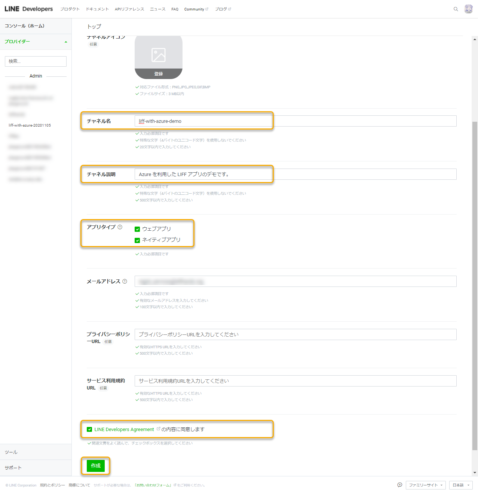

チャネルが作成できたら、「LIFF」タブを開き、「追加」ボタンを選択します。

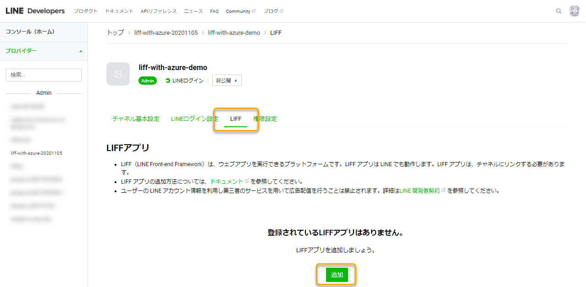

下記を入力し、「追加」ボタンを選択しLIFFアプリを追加します。

- 「LIFFアプリ」に任意のアプリ名を入力します。
- 「サイズ」は「Full」を選択します。
- 「エンドポイントURL」は、Azure Static Web Apps をデプロイした後に決まるので、とりいそぎ別の https で始まるURLを入力します。（例: `https://example.com` ）
- 「Scope」は、「profile」にチェックを付けます。
- 「ボットリンク機能」は、「On (Normal)」をチェックします。

LIFFアプリを追加すると、「LIFF ID」が発行されます。のちに使うので、控えておいてください。

## GitHub リポジトリをテンプレートから作成する

つぎに、テンプレートをもとに、ご自身が操作する GitHub リポジトリを用意します。

[本リポジトリ](https://github.com/dzeyelid/line-liff-with-azure-handson) のトップページから、上部の「Use this tempalte」ボタンを選択し、このリポジトリテンプレートをベースにリポジトリを作成してください。

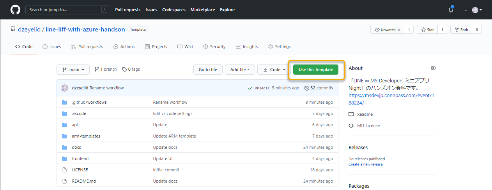

下記を入力し、「Create repository from template」ボタンを選択しリポジトリを作成します。

- 「Repository name」に、任意のリポジトリ名を入力します。
- 「Public」を選択します。
- 「Include all branches」はチェックしません。

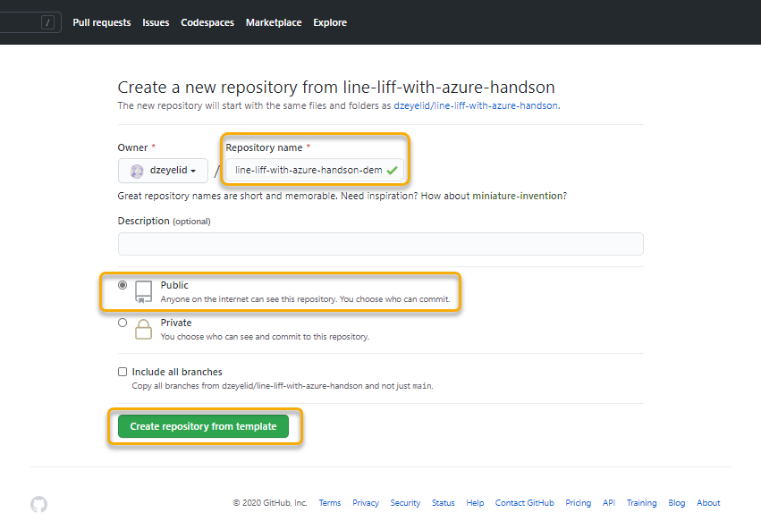

## GitHub の Personal access token を生成する

後述のデプロイで利用するため、GitHub の Personal access token を生成します。

下記の手順をもとに進み、 `public_repo` に設定をして、画面下部の「Generate token」ボタンを選択し、トークンを生成します。

- [個人アクセストークンを使用する - GitHub Docs](https://help.github.com/ja/github/authenticating-to-github/creating-a-personal-access-token)

生成されたトークンはここでしか表示されないので、適宜控えてください。

## Azure Static Web Apps と Cosmos DB をデプロイする

Azure Static Web Apps と Azure Cosmos DB をデプロイします。

下記のボタンを選択すると、Azure ポータルで「Costom deployment」画面が開きます。

下記を入力し、「Review + create」ボタンを選択して入力内容を表示します。

- 「Resource group」は、「Create new」を選択し、表示されたダイアログに任意のリソースグループ名を入力し、「OK」を選択します。
- 「Region」は、近いリージョン（`Japan East` や `Japan West` など）を入力します。
- 「Identifier」は、グローバルで一位になるような文字列を入力します。（※ この文字列を使う Cosmos DB のリソース名がグローバルで一意になる必要があります。）
- 「Static Web App Location」は、近いリージョンを指定します。日本からは `eastasia` のままで構いません。
- 「Static Web App Sku Tier」および「Static Web App Sku Name」は、「Free」のままで構いません。
- 「Static Web App Repository Url」は、先ほど作成した GitHub リポジトリのURLを設定します。（例: `https://github.com/<owner>/<repository>` ）
- 「Static Web App Repository Token」は、先ほど生成した GitHub persional access token を設定します。
- 「Static Web App Branch」「Static Web App App Location」「Static Web App Api Location」「Static Web App App Artifact Location」は変更しません。
- 「Static Web App Exists」「Cosmos Db Enable Free Tier」「Cosmos Db Database Throughput」はそのままで構いません。

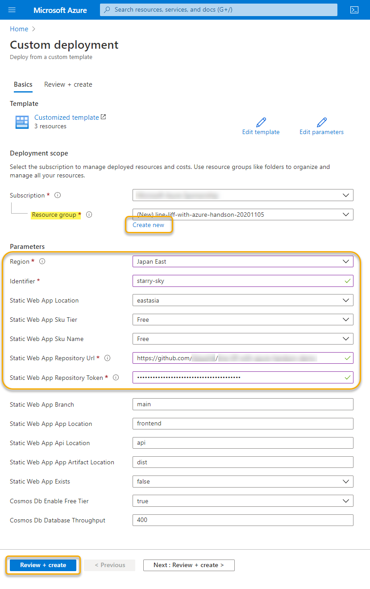
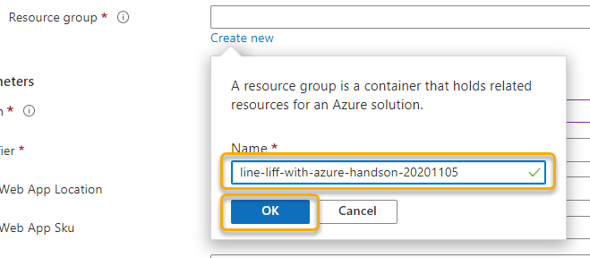

入力内容を確認し、「Create」ボタンを選択しデプロイを実行します。

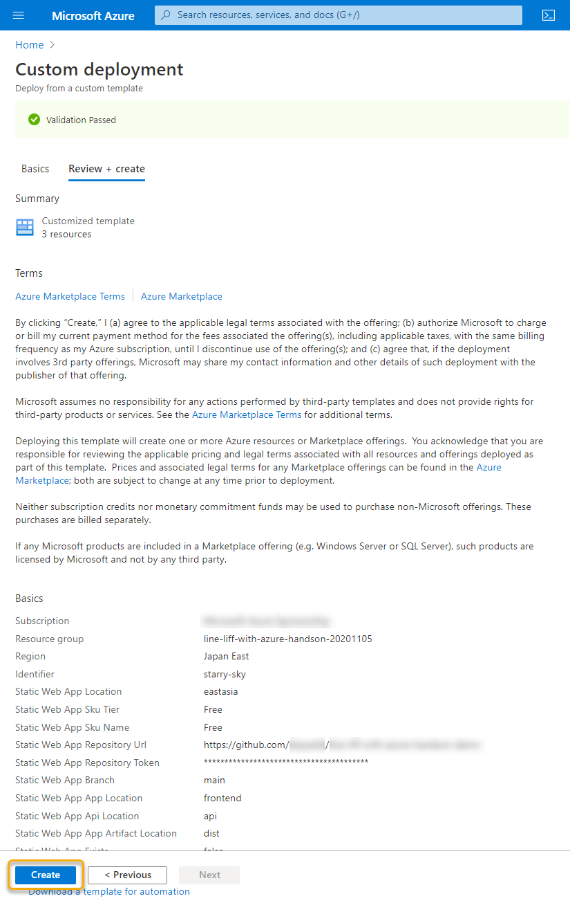

デプロイが完了するまでしばらく時間がかかります。

デプロイが完了すると下記の画面に遷移します。「Go to resource group」ボタンを選択し、作成したリソースグループに移動します。

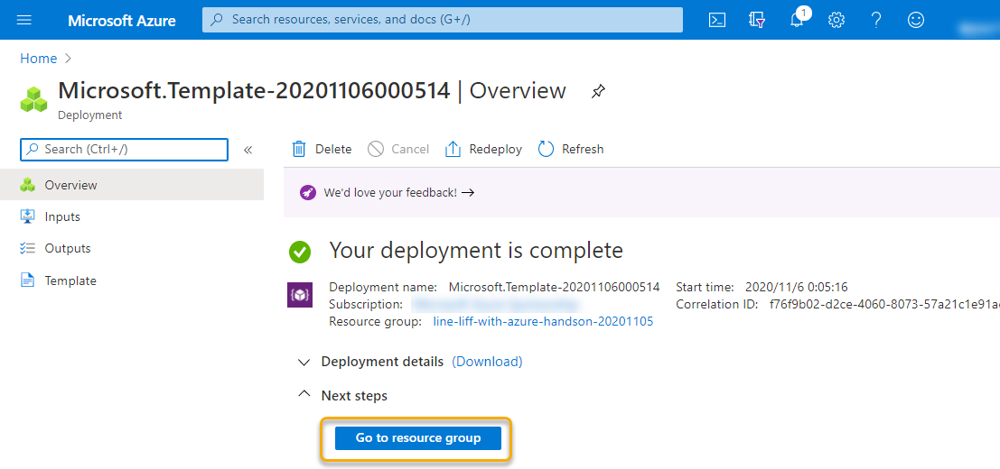

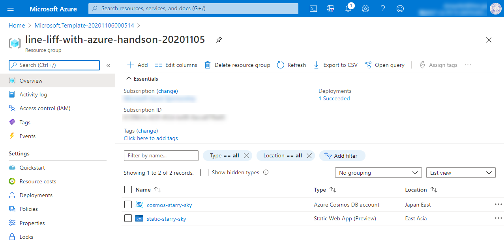

## Azure Static Web Apps の Functions の Application settings を設定する

Azure Static Web Apps の Functions の Application settings の設定を行います。

このうち Cosmos DB の接続文字列が必要なので、先に取得しておきましょう。

まず、リソースグループのリソース一覧から Cosmos DB を選択し、開きましょう。

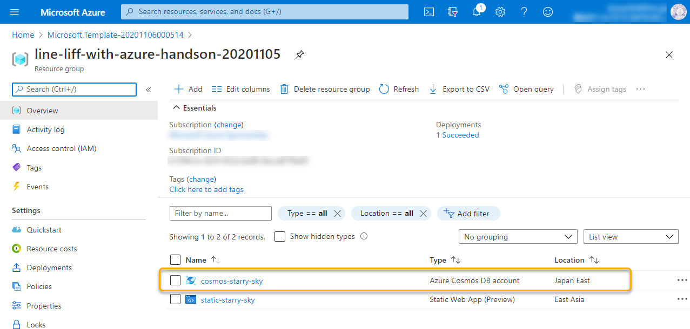

Cosmos DB の画面で、左メニューから「Keys」を選択します。

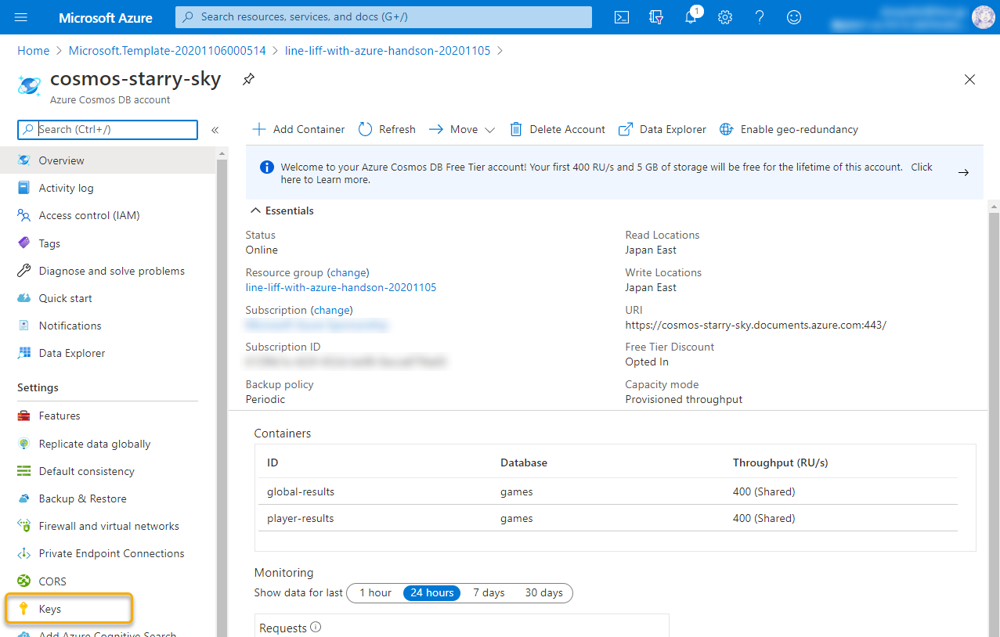

Cosmos DB のキー及び接続文字列が表示されます。「Read-write Keys」タブの「PRIMARY CONNECTION STRING」の値をコピーし控えておきましょう。

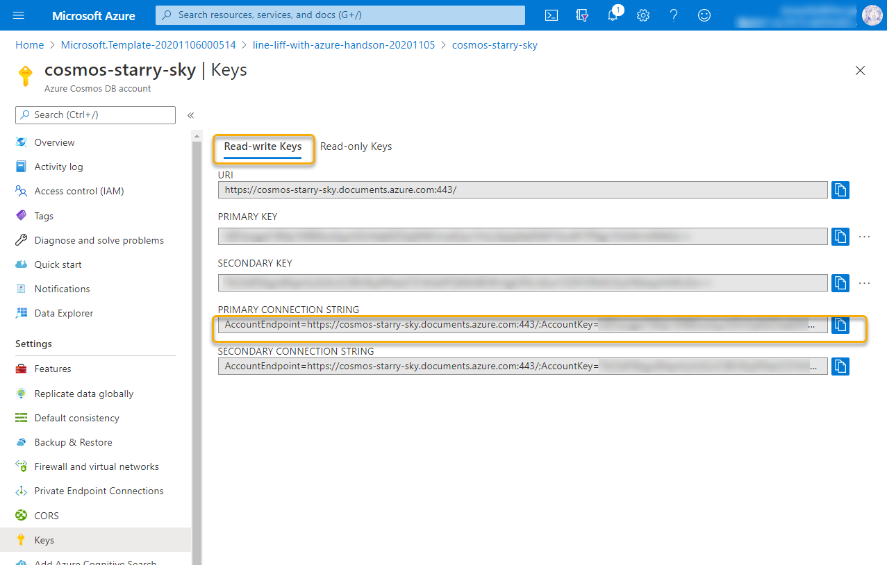

それでは、Static Web Apps の設定に進みましょう。

まず、リソースグループの画面に戻ります。前述の画面空移動するには、画面上部のリソースグループ名の部分を選択すると、リソースグループに遷移できます。

リソースグループの画面で、Static Web Apps を選択し開きます。

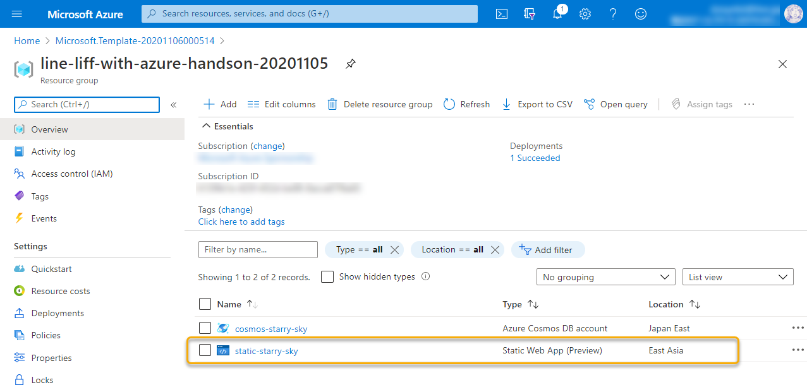

| Variable name | value |
|----|----|
| `COSMOS_DB_CONNECTION_STRING` | Cosmos DB の接続文字列（Connection string） |
| `COSMOS_DB_CONTAINER_ID_GLOBAL_RESULTS` | `global-results` |
| `COSMOS_DB_CONTAINER_ID_PLAYER_RESULTS` | `player-results` |
| `COSMOS_DB_DATABASE_ID` | `games` |

## GitHub リポジトリの Secrets を設定する

GitHub Actions のワークフローによる Azure Static Web Apps のデプロイに必要な Secret を設定します。

作成した GitHub リポジトリの「Settings」から「Secrets」を開きましょう。

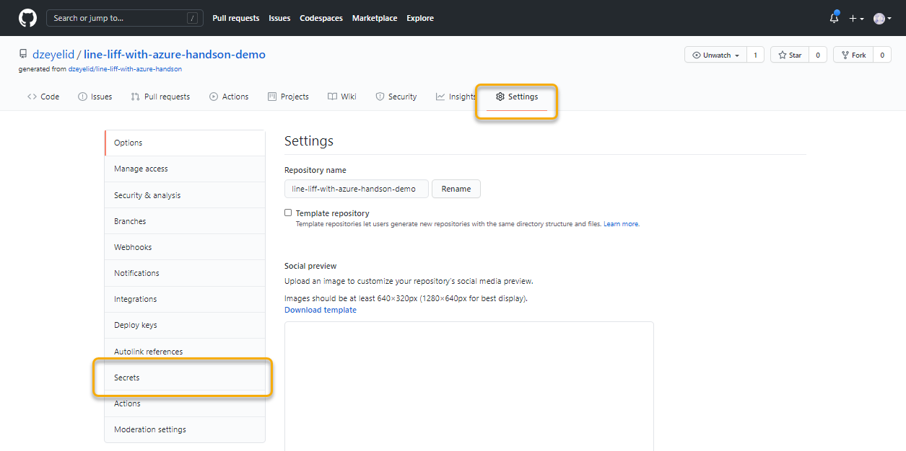

すると、すでにひとつ `AZURE_STATIC_WEB_APPS_API_TOKEN_XXXX_XXXX_000000000` というような secret が作成されていることがわかります。これは、Azure Static Web Apps のリソースをデプロイしたときに自動的に作成された secret です。ワークフローはこの secret を用ることによってコードを Azure Static Web Apps にデプロイできるようになります。

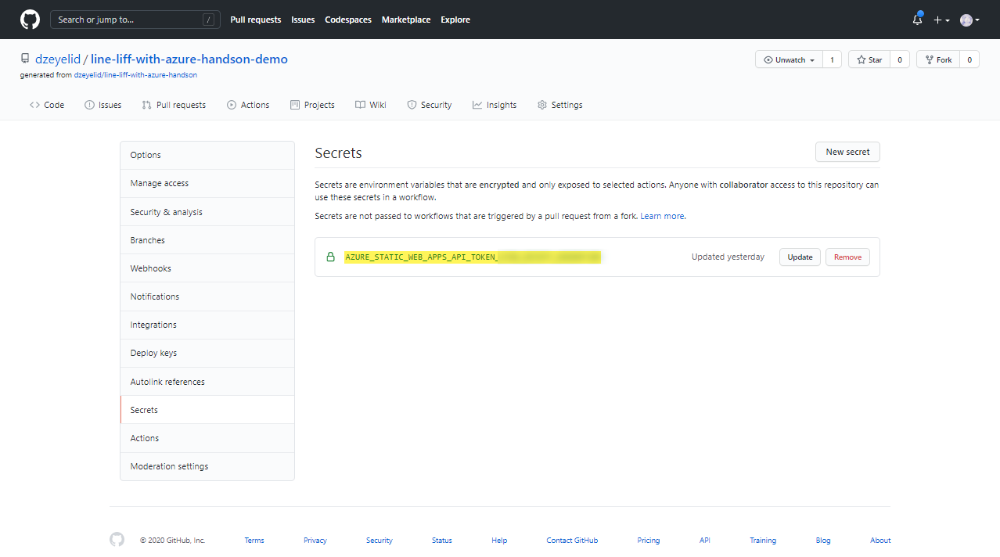

もうひとつ secret を追加しましょう。

「New secret」ボタンを選択し、secret 作成画面を開きます。

「Name」に `VUE_APP_LIFF_ID` を指定し、「Value」に前の手順で控えた「LIFF ID」を指定し、「Add secret」ボタンを選択して保存します。

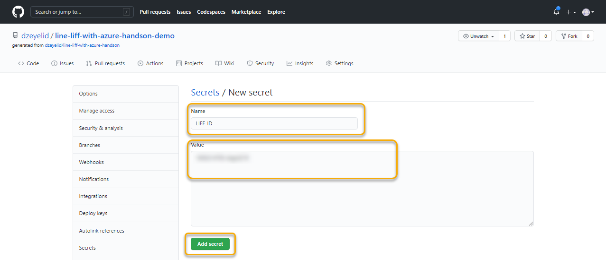

## GitHub リポジトリのワークフローを修正する

次に、ワークフローを修正します。GitHub のリポジトリの `.github/workflows` ディレクトリを開きましょう。

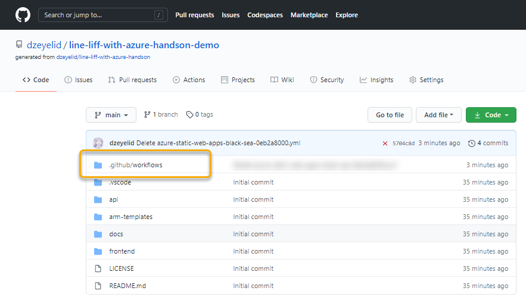

`.github/workflows` には、2つのワークフローがあることがわかります。

Azure Static Web Apps はデプロイされると指定したリポジトリに `azure-static-web-apps-xxx-xxx-000000000.yml` という様なファイル名のワークフローを作成します。

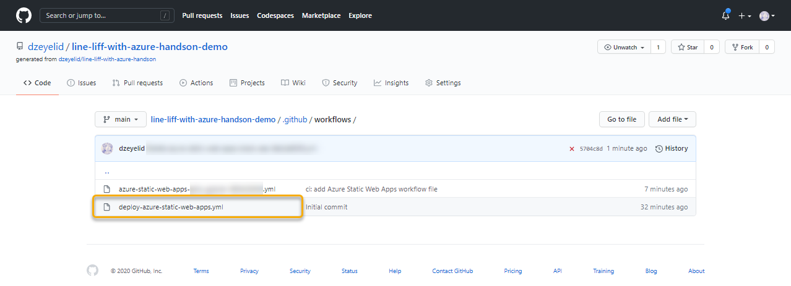

`azure-static-web-apps-xxx-xxx-000000000.yml` を開いてみると、すでに `Azure/static-web-apps-deploy@v0.0.1-preview` という Azure Static Web Apps にデプロイするための GitHub アクションが設定されていることがわかります。

先ほど確認した secret `AZURE_STATIC_WEB_APPS_API_TOKEN_XXXX_XXXX_000000000` もここで利用されていることがわかります。

さて、本アプリを正しくデプロイするために一部編集します。

LIFF ID を設定する

これをワークフローに設定します。

----

### メモ

LIFF ID は GitHub Secret に指定する

コラム: テンプレートからリポジトリを作成すると、 `.github/workflows/deploy-azure-static-web-app.yml` があるので GitHub Actions のワークフローが実行されますが、 `azure_static_web_apps_api_token was not provided.` というエラーが発生し失敗します。
